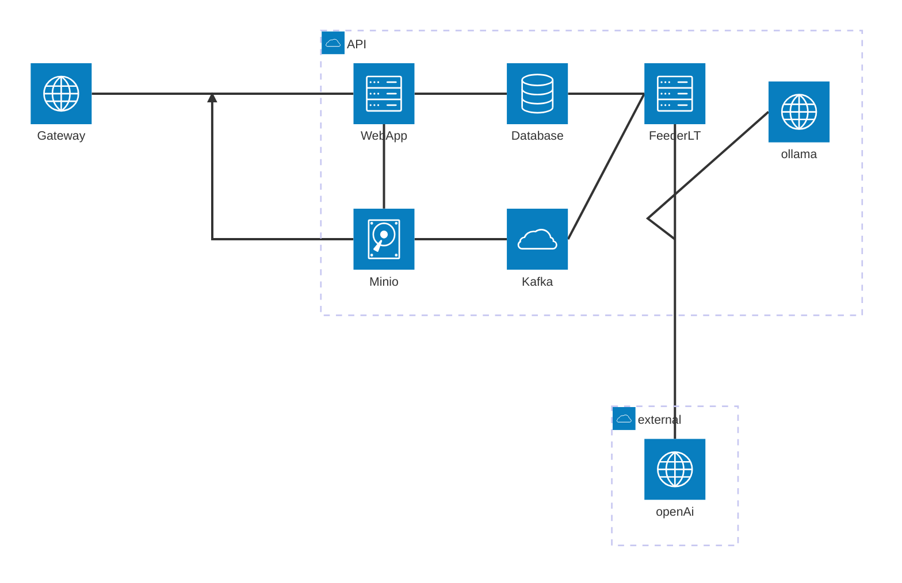

# RAG_UPLOADER

## Architecture 

The design is self-hostable with Open AI being an optional dependency in favor of Ollama. 

The docker compose provided includes the services required to run. 
But no detailed configuration is provided yet.



### Required accounts

 - Open AI 
 - Hugging Face

### Start the services

```
docker compose up -d
```

### Extration app and RAG creator

When an image arrives to the Bucket service, it emits a kafka event and it is read
by the `image_feeder` service.

The service will adjust the image for usable sizes as thumbnail and normal web view mode.
By default generates __webp__ images for all assets.for all assets.

It will use RAG and GenAI strategies to parametrize the assets and generate filterable data.

The processed images may be accessed and queries on the frontend.

The service is found on `server_app/image_feeder`, To run the service:

```
cargo run
```

#### RAG and GenAI strategies.

To extract the embeddings from images it uses CLIP embeddings. The CLIP embeddings 
allows to generate the vector representation from the images as well as text, this 
enables running search queries against the data.

The service resizes the images with its width capped at 512px to fit within the model
split capabilites.

The embeddings model runs local. So, on the first run, it will need to wait for the 
download of the embeddings model. 
__feeder_service__ will generate a __fastembed_cache__ folder with your model.

Appart of CLIP for the images. The system uses genAI technologies to extract 
descriptors as text for each image, such as:

 - Text Description
 - Context Tags

It uses structed output to generate the formated data.
This enables richer search parameters and allows the UI to perform more accurate 
search filters.

To use this inference two options are possible. Local and remote.

Ollama along with the Llava multimodal model gives you the opportunity to run and
generate your inferences locally, giving you a complete self-hosted advance RAG system.

To use an online service Open AI is the current alternative.

To select which service to run set `USE_LLM_SERVICE` to "openai" or "ollama".

### User facing web-app endpoints

The user facing app allows you as user to see and upload your local images.

To upload and retrieve images the service needs to communicate with Minio, 
it gets signed urls. So an unauthorized user should not have direct read
access to it.

To run the user facing server / web client. Go to the webapp_gallery, then run
`npm run dev`. Consider the port it gives you.

**Note** Still working on the url linking.

To see the gallery of images:

`http://localhost:5173/gallery`

To see the upload page.

`http://localhost:5173/upload`

## Services configuration

The provided `sh` files 

### Kafka setup

The kafka configuration is rather simple, only ensure the topic is created.
The __feeder__ service may ensure to create the topic, though to create it manually.
Given the messages volume, a single partition and service is enough to start.

Within the container

```
/bin/kafka-topics.sh --create --topic minio-topic --bootstrap-server localhost:9092
```

(Optional) To see the topic description

```
/bin/kafka-topics --describe --topic minio-topic --bootstrap-server localhost:9092
```

Or for your running consumer (feeder_service)

```
/bin/kafka-console-consumer --bootstrap-server localhost:9092 --group imgfeeder-001 --describe
```

### Bucket storage 

Use an S3 compatible storage solution called Minio.

Though the setup is rather simple, the commands are server specific using their own `mc` cli.
For the kafka connection it is necessary that the env vars are correctly setup.


Create an alias (raggi) and the buckets.

**Note**: The symbols `${XXX}` are env vars.

```
mc alias set raggi http://${MINIO_DOCKER_SERVICE}:${MINIO_PORT} ${MINIO_ACCESS_KEY} ${MINIO_SECRET_KEY}

mc mb raggi/ragged-img
mc mb raggi/rag-upload
mc mb raggi/rag-upload/feeder
```

Create a new user. (Protect your secrets).
Assign the user to the alias. Assign IAM (AWS compatible) bucket permissions.

```
mc admin user add raggi ${RAG_USER} ${RAG_USER_SECRET} 
mc admin policy attach raggi readwrite  --user ${RAG_USER}
mc admin policy detach raggi writeonly --user ${RAG_USER}
mc admin policy detach raggi readonly --user ${RAG_USER}
```

Get the access_key / access_token for the user

```
mc admin user svcacct add raggi ${RAG_USER}
```

Add the kafka notifications.

```
mc event add raggi/rag-upload/feeder arn:minio:sqs::primary:kafka \ --event s3:ObjectCreated:*
```

### Database

Right now there are no migrations yet. The file in db_storage/src/lib.rs contains the 
create statements to run.

To access psql console (Works local only). 

```
psql -U postgres
```

### Ollama

You need to download Ollama and the Llava model if you want to run the prompts 
and inferences locally.

