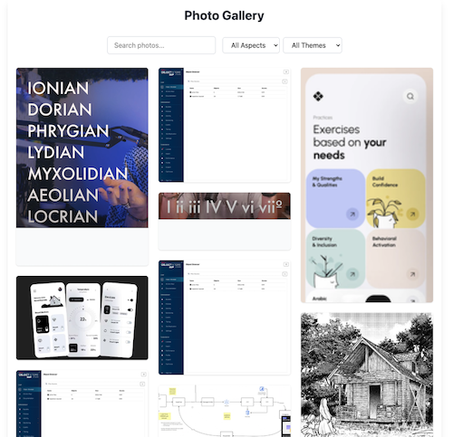
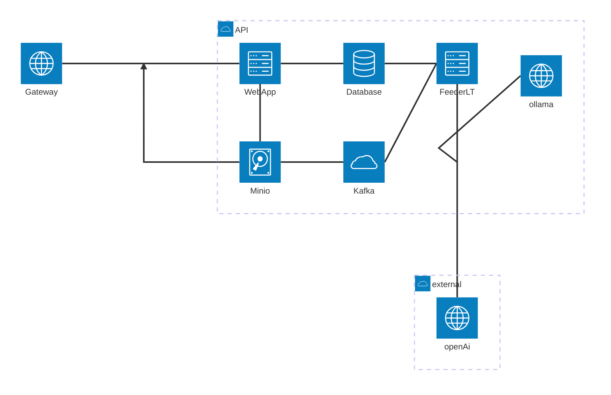

# RAG_UPLOADER

Ever imagine a self hosted system to visualize your memories stored a pictures. That also leverages RAG ideas 
to characterize them and preserving your privacy.

Here the aim is to create a photo gallery that gives also meaning to each image, allows you search and filter with the
help of mother technologies.



## Architecture 

The design is self-hostable with Open AI being an optional dependency in favor of Ollama. 

The docker compose provided includes the services required to run. 
But no detailed configuration is provided yet.


```mermaid
architecture-beta
    group api(cloud)[API]
    group external(cloud)[external]

    service db(database)[Database] in api
    service minio(disk)[Minio] in api
    service kafka(cloud)[Kafka] in api
    service feederServer(server)[FeederLT] in api
    service sveleteServer(server)[WebApp] in api
    service ollama(internet)[ollama] in api
    service bottom_gateway(internet)[Gateway]

    junction tointernet 
    junction aiProvide in api

    service openAi (internet)[openAi] in external

    tointernet:L -- R:bottom_gateway
    minio:L --> B:tointernet
    sveleteServer:L -- R:tointernet

    minio:T -- B:sveleteServer
    kafka:L -- R:minio
    feederServer:L -- R:kafka
    db:L -- R:sveleteServer
    feederServer:L -- R:db

    aiProvide:T -- B:feederServer
    aiProvide:B -- L:ollama
    openAi:T -- B:aiProvide
```

### Required accounts

 - Open AI 
 - Hugging Face

### Start the services

```
docker compose up -d
```

### Extration app and RAG creator

When an image arrives to the Bucket service, it emits a kafka event and it is read
by the `image_feeder` service.

The service will adjust the image for usable sizes as thumbnail and normal web view mode.
By default generates __webp__ images for all assets.for all assets.

It will use RAG and GenAI strategies to parametrize the assets and generate filterable data.

The processed images may be accessed and queries on the frontend.

The service is found on `server_app/image_feeder`, To run the service:

```
cargo run
```

#### RAG and GenAI strategies.

To extract the embeddings from images it uses CLIP embeddings. The CLIP embeddings 
allows to generate the vector representation from the images as well as text, this 
enables running search queries against the data.

The service resizes the images with its width capped at 512px to fit within the model
split capabilites.

The embeddings model runs local. So, on the first run, it will need to wait for the 
download of the embeddings model. 
__feeder_service__ will generate a __fastembed_cache__ folder with your model.

Appart of CLIP for the images. The system uses genAI technologies to extract 
descriptors as text for each image, such as:

 - Text Description
 - Context Tags

It uses structed output to generate the formated data.
This enables richer search parameters and allows the UI to perform more accurate 
search filters.

To use this inference two options are possible. Local and remote.

Ollama along with the Llava multimodal model gives you the opportunity to run and
generate your inferences locally, giving you a complete self-hosted advance RAG system.

To use an online service Open AI is the current alternative.

To select which service to run set `USE_LLM_SERVICE` to "openai" or "ollama".

### User facing web-app endpoints

The user facing app allows you as user to see and upload your local images.

To upload and retrieve images the service needs to communicate with Minio, 
it gets signed urls. So an unauthorized user should not have direct read
access to it.

To run the user facing server / web client. Go to the webapp_gallery, then run
`npm run dev`. Consider the port it gives you.

**Note** Still working on the url linking.

To see the gallery of images:

`http://localhost:5173/gallery`

To see the upload page.

`http://localhost:5173/upload`

## Services configuration

The provided `sh` files 

### Kafka setup

The kafka configuration is rather simple, only ensure the topic is created.
The __feeder__ service may ensure to create the topic, though to create it manually.
Given the messages volume, a single partition and service is enough to start.

Within the container

```
/bin/kafka-topics.sh --create --topic minio-topic --bootstrap-server localhost:9092
```

(Optional) To see the topic description

```
/bin/kafka-topics --describe --topic minio-topic --bootstrap-server localhost:9092
```

Or for your running consumer (feeder_service)

```
/bin/kafka-console-consumer --bootstrap-server localhost:9092 --group imgfeeder-001 --describe
```

### Bucket storage 

Note: S3 compatibility will be eventually brought back.


It uses an nginx WebDAV server to act as a simple file host bucket.

The upload base folder must be setup and configured for read / write access. 


```bash
mkdir -p ./www-data/incoming
chmod -R 777 ./www-data
docker compose up -d
```

Note 1. Consider using `chmod -R 775`  instead of 777.

Note 2. This is a not a safe production / "open to the internet" setup.

### Database

To access psql console in your local instance and create the initial database. 

```
psql -U postgres
```

```
create DATABASE rag_db;
\c rag_db 
```

Migrations

There is a migrations folder inside server_apps/db_storage/src/migrations. You can use any program that
can run them in sequential order, sqlx-cli is recommended.

```
cargo install sqlx-cli
```

Run the  migration

```
cd db_storage
sqlx migrate run --source src/migrations
```

Support command (on your own risk)

```
# Create database
sqlx database create
# Drop database
sqlx database drop
# Add a new migration file
sqlx migrate add -r <filename>

```

### Machine extra depencencies (For dev container)

```
apt install cmake protobuf-compiler
```

### Ollama

You need to download Ollama and the Llava model if you want to run the prompts 
and inferences locally.

